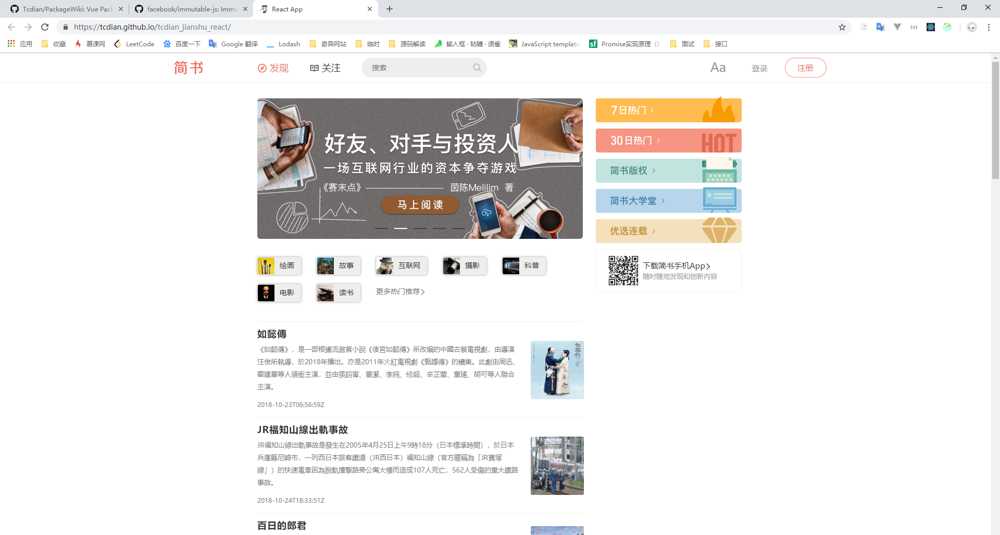
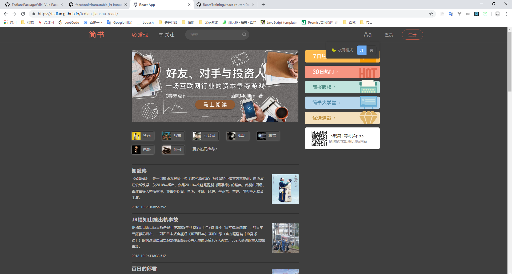
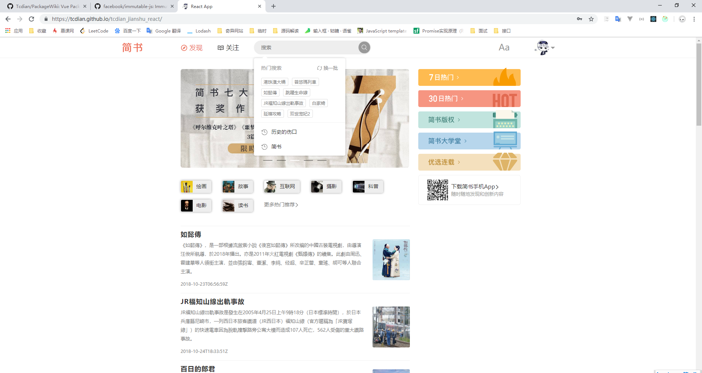
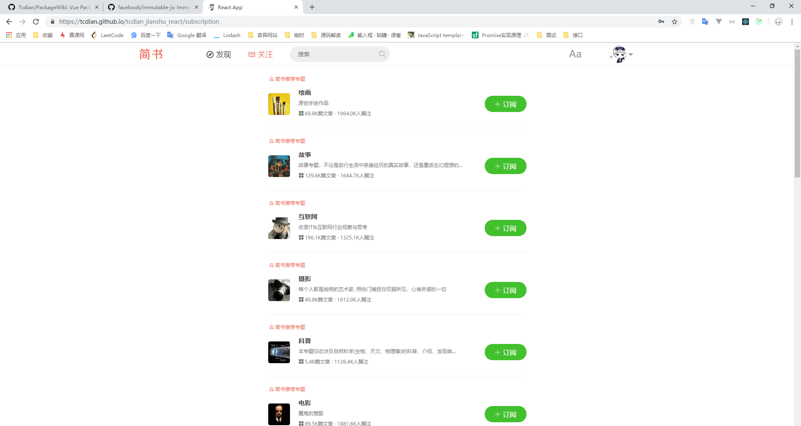
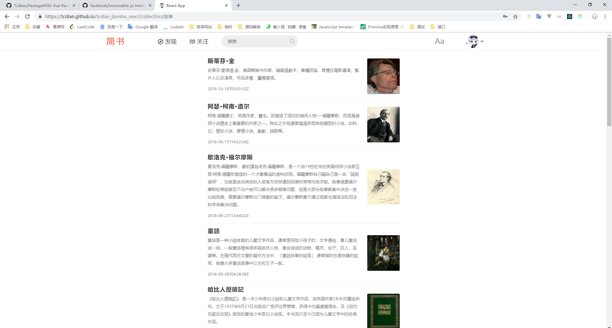
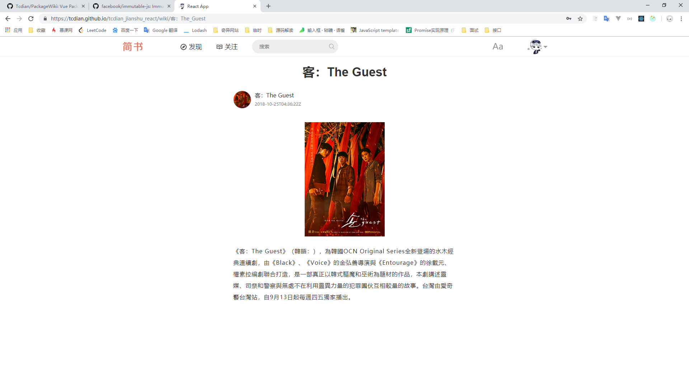
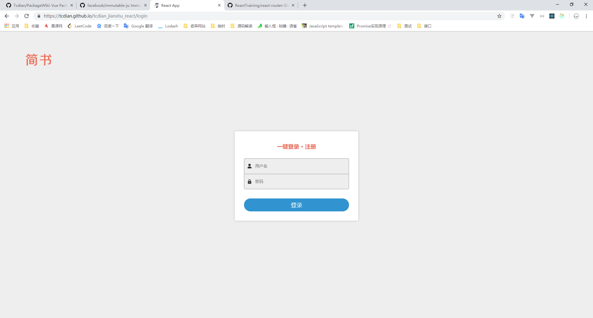

# tcdian_jianshu_react

### [在线 Demo](https://tcdian.github.io/tcdian_jianshu_react/)

##### 部分数据来自维基百科, 客户端需要可以直接访问 Wikipedia 服务器

### 说明

使用 React 仿写了一个简单的简书, 纯前端的项目, 部分数据使用 easy-mock 模拟 (easy-mock 响应有时会超级慢~ ) , 还有一部分数据来自维基百科, 客户端需要可以直接访问 Wikipedia 服务器, 才能预览全部功能　 
项目完成时间仓促, 存在一些 bug , 欢迎大家帮忙指正, 多谢~

### 截图

* 项目首页, 支持下拉加载新数据 

   

* 夜间模式 

   

* 项目搜索栏, 支持联想搜索, 热门搜索, 历史搜索 

    

* subscription 页面, 需要登录后可以访问 

    

* collection 页面 

    

* 详情页面 

    

* 登录页面 

    

### 技术栈
* React
* Redux
* React Router